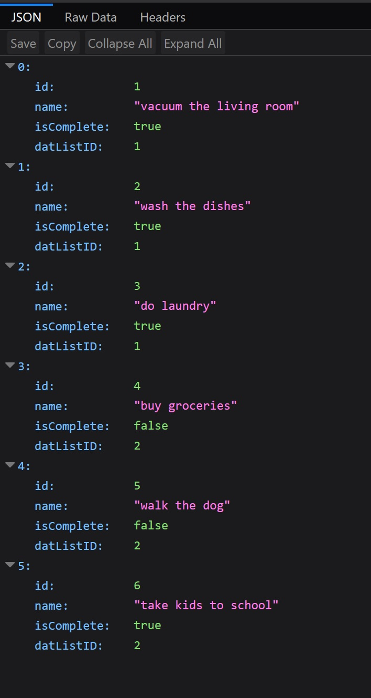
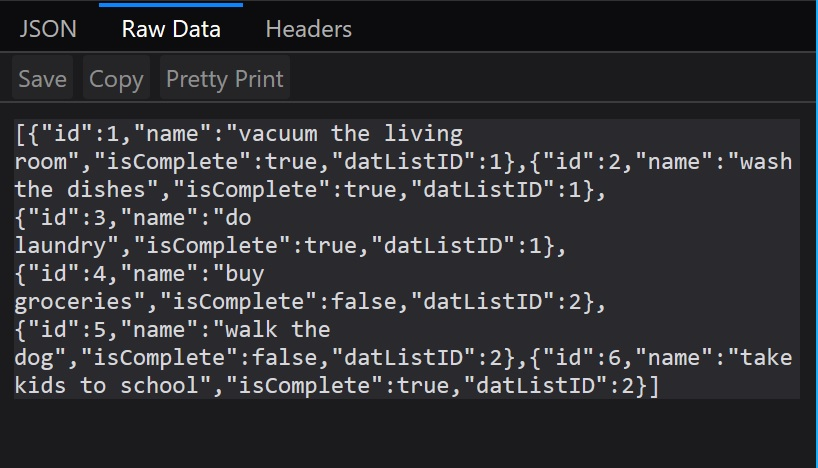
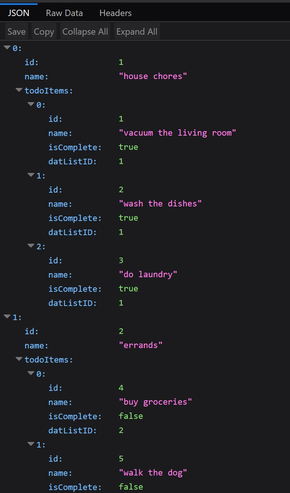
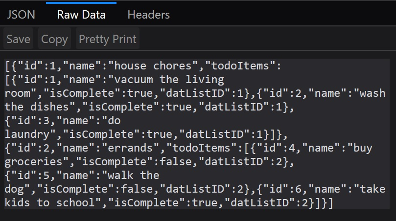

# Lab 17: Web APIs
 CODE: Web APIs assignment for Code Fellows 401 C#/ASP.NET course

**Author**: Earl Jay Caoile  
**Version**: 1.0.0

## Overview
This web API contains a TODO items as well as TODO lists.
Users can create, edit, and delete both TODO items as well
as TODO lists.

## Getting Started
The following is required to run the program.
1. Visual Studio 2017 
2. The .NET desktop development workload enabled
3. ASP.NET web API packages

## Example
  
  
  
  

## Happy path
- start the API within Visual Studio by pressing the green play button
- open Postman and enter the localhost URL along with /api/todoitem
- view all of the todo items
- perform CRUD operations on the todo items
- change the URL after the home localhost URL to /api/todolist
- view all of the todo lists
- perform CRUD operations on the todo lists
- smile

## Architecture
This application is created using ASP.NET Core 2.1 Web Application  
*Languages*: C#  
*Type of Applicaiton*: Web API  

## Change Log
06-27-2018 5:00 PM - initial scaffolding  
06-28-2018 2:00 PM - methods created for todo items  
06-29-2018 6:00 PM - methods created for todo lists  
06-30-2018 2:00 PM - tests created and passed  
06-30-2018 3:00 PM - commented API methods  
06-30-2018 3:30 PM - finished README  

