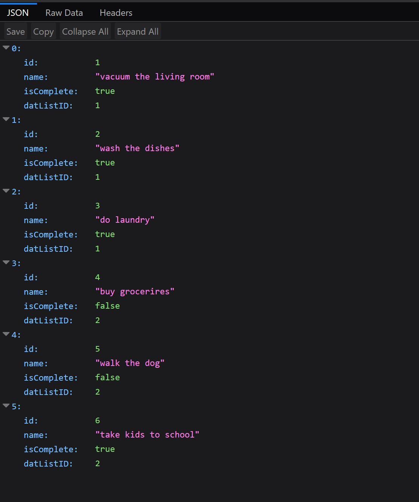
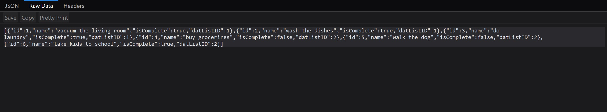
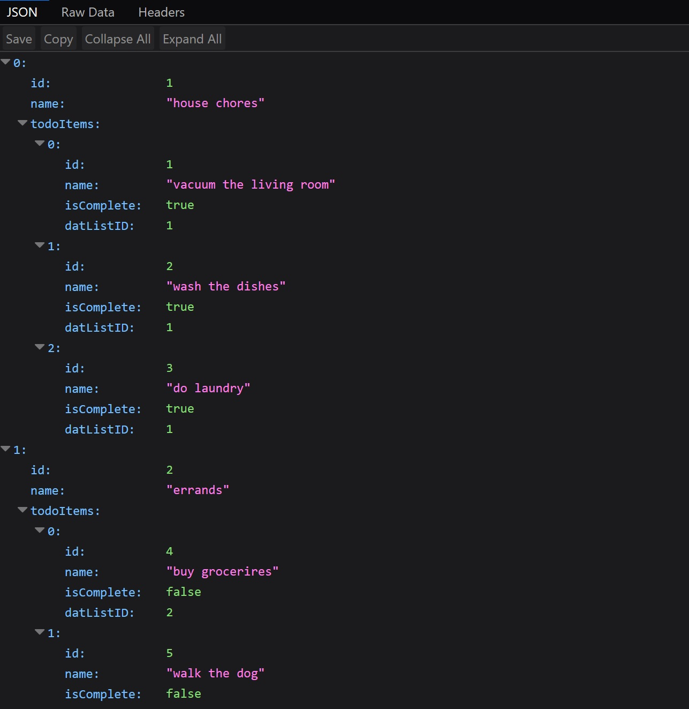
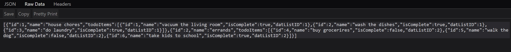

# Lab-17-API-Double-Resources
 CODE: Web API Double Resource assignment for Code Fellows 401 C#/ASP.NET course

**Author**: Earl Jay Caoile  
**Version**: 1.0.0

## Overview
This MVC web application does blah, blah, blah!

## Getting Started
The following is required to run the program.
1. Visual Studio 2017 
2. The .NET desktop development workload enabled
3. ASP.NET web API packages

## Example
  
  
  
  
  

## Happy path
- open home page
- click students page button
- view studets and perform CRUD operations (create, edit, view details, delete)
- click button to return to home page
- click courses page button
- view courses and perform CRUD operations (create, edit, view details, delete)
- smile

## Architecture
This application is created using ASP.NET Core 2.1 Web Application  
*Languages*: C#, HTML, CSS  
*Type of Applicaiton*: Web Application  

## Change Log
06-27-2018 5:00 PM - initial scaffolding  
